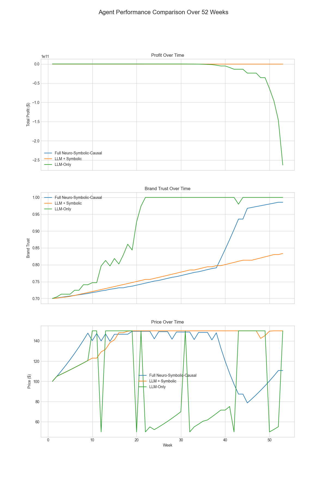
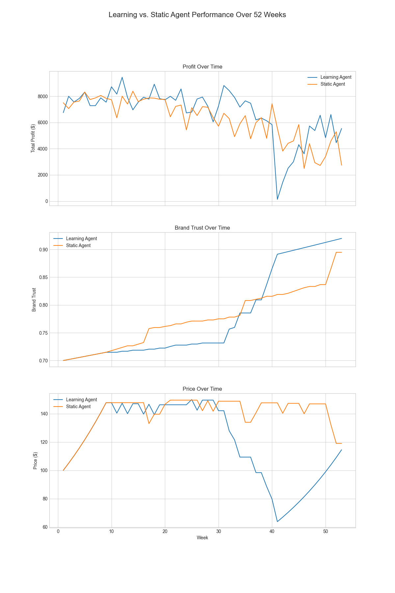

# Project Chimera: A Neuro-Symbolic-Causal AI Agent for Strategic Decision-Making

[](https://opensource.org/licenses/MIT)
[](https://www.python.org/downloads/)
[](http://makeapullrequest.com)

**Project Chimera is an advanced AI agent designed to overcome the critical limitations of standard Large Language Models (LLMs) in strategic business environments. By integrating a hybrid Neuro-Symbolic-Causal architecture, this agent makes decisions that are not only intelligent but also safe, explainable, and provably profitable.**

---

### The Problem: Why Raw LLMs are Dangerous for Business

Modern LLMs are powerful, but when entrusted with critical business decisions, they can be dangerously naive and unpredictable. Without proper guardrails, they can make catastrophic mistakes. Our benchmark experiment proves this: we tasked a pure `LLM-Only` agent with managing a simulated e-commerce business for one year. Lacking an understanding of rules or the causal consequences of its actions, it drove the company into a **multi-billion dollar loss**.



**Final Results (After 52 Weeks):**

| Agent Type | Final Profit | Final Brand Trust |
| :--- | :---: | :---: |
| **Project Chimera (Full Agent)** | **+$2,643.72** | **0.986** |
| LLM + Symbolic | -$1,600.04 | 0.834 |
| LLM-Only | -$262 Billion | 1.000 (at catastrophic cost) |

*Our agent is the only one to achieve both significant profit and high brand trust, successfully navigating the complex trade-offs.*

---

### Our Solution: The Chimera Agent in Action

Project Chimera solves this by providing the LLM with a **Symbolic** safety net and a **Causal** oracle. It doesn't just guess; it brainstorms multiple strategies, checks them against business rules, and predicts their financial outcomes to find the optimal path.

**See the agent's intelligence in action in our interactive demo:**

<a></a>

---

### The Proof: The Power of Learning

The most advanced version of Project Chimera features a **continuous learning mechanism**. The agent retrains its Causal Engine with new data from its own experiences every 10 weeks. The result? A learning agent that is not only smarter but demonstrably superior.

In our head-to-head simulation, the **Learning Agent** achieved nearly **2x higher profit** than its static, non-learning counterpart.


*(The Learning Agent (blue) consistently finds more profitable strategies over a 52-week period.)*

---

### The Chimera Architecture

Project Chimera wraps the creative "neural" brain of an LLM with two critical layers of intelligence:

```mermaid
graph TD
    A[Neuro (LLM)] -->|Hypotheses| B[Symbolic Guardian]
    B -->|Rules| C{Is Valid?}
    C -->|Yes| D[Causal Engine]
    C -->|No| B
    D -->|Profit Impact| E[LLM Brain]
    E -->|Decides| F[Optimal Action]
```

* **🧠 Neuro (The Brain):** The creative core (GPT-4o) that understands goals and brainstorms diverse strategies.
* **🛡️ Symbolic (The Guardian):** A rule engine that acts as a safety net, preventing catastrophic, rule-breaking decisions.
* **🔮 Causal (The Oracle):** A data-driven causal inference engine (`EconML`) that provides the agent with a crucial superpower: predicting the profit impact of its potential decisions.

---

### ✨ Key Features

* **Multi-Hypothesis Reasoning:** The agent actively brainstorms and evaluates multiple strategies before making a data-driven recommendation.
* **Dynamic Learning from Experience:** The agent's Causal Engine retrains periodically on its own performance data, allowing it to adapt and improve.
* **Advanced Economic Simulator:** A sophisticated simulation environment featuring non-linear dynamics like price elasticity and diminishing returns.
* **Interactive Strategy Lab:** A full-featured Streamlit application (`app.py`) for real-time interaction and analysis.
* **Automated Benchmarking Suite:** A powerful research script (`benchmark.py`) to rigorously compare different agent architectures.

---

### 🚀 Live Demo & Usage

#### Try the Interactive Lab

You can try a live version of the Strategy Lab here:

<a></a>

#### Getting Started

1.  **Clone the repository:**
    ```bash
    git clone [https://github.com/akarlaraytu/Project-Chimera.git](https://github.com/akarlaraytu/Project-Chimera.git)
    cd Project-Chimera
    ```
2.  **Create a virtual environment and install dependencies:**
    ```bash
    python3 -m venv venv
    source venv/bin/activate
    pip install -r requirements.txt
    ```
3.  **Set your OpenAI API Key:**
    ```bash
    export OPENAI_API_KEY='sk-...'
    ```
4.  **Run the Interactive Demo:**
    ```bash
    streamlit run app.py
    ```
5.  **Run the Automated Benchmarks:**
    ```bash
    python3 benchmark.py
    python3 benchmark_learning.py
    ```

---

### 🗺️ Future Roadmap

Project Chimera is a living project. The next steps in our vision include:

* **Deep XAI (Explainable AI):** Integrating a Causal Graph visualization layer to explain *why* the Causal Engine predicted a certain outcome.
* **Multi-Agent Competitive Simulations:** Evolving the benchmark into an ecosystem where multiple Chimera agents compete against each other in the same market.
* **Domain-Agnostic Framework:** Refactoring the core logic into a general-purpose framework for other domains like finance or healthcare.

---

### 🤝 Contributing

Contributions, issues, and feature requests are welcome! Feel free to check the [issues page](https://github.com/akarlaraytu/Project-Chimera/issues).

### 📄 License

This project is licensed under the MIT License - see the [LICENSE.md](LICENSE.md) file for details.

---

*Developed with passion by [Aytug Akarlar](https://www.linkedin.com/in/aytuakarlar/) in collaboration with a strategic AI partner.*