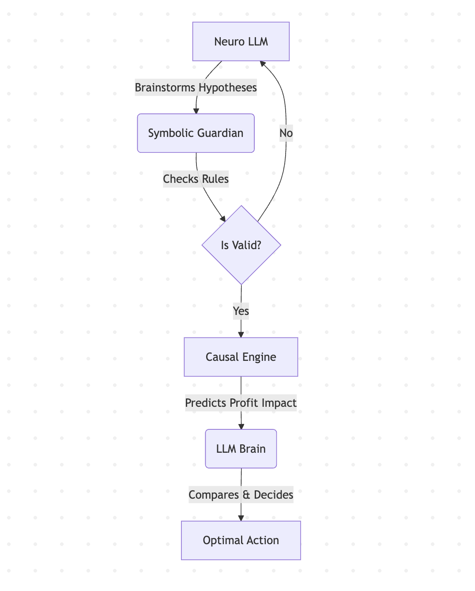
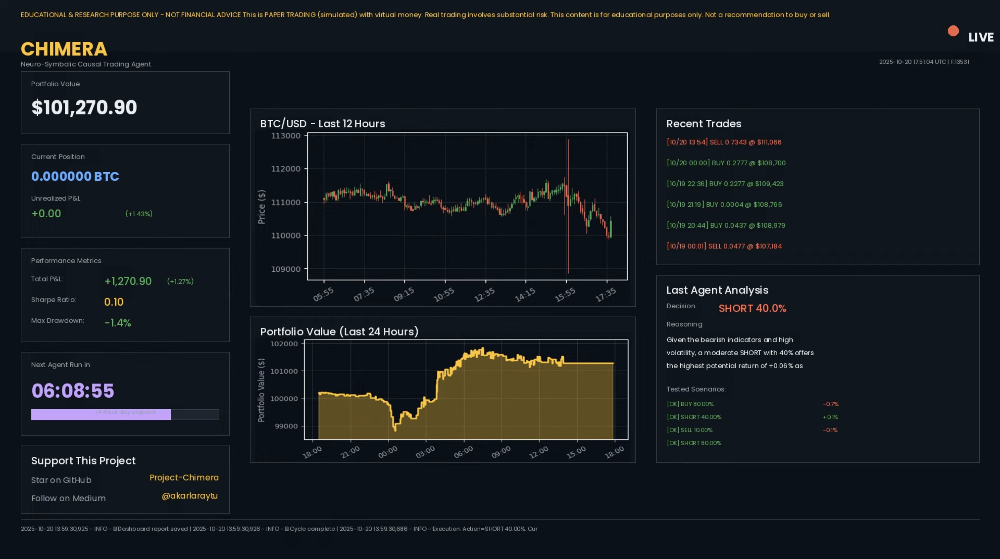
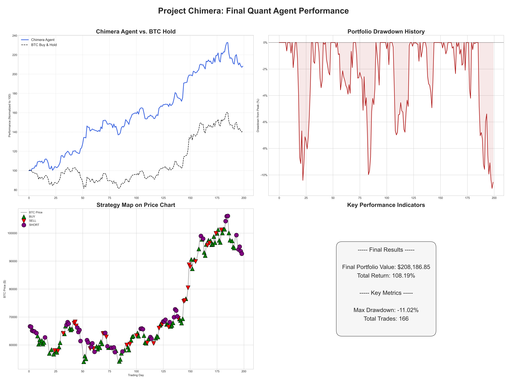
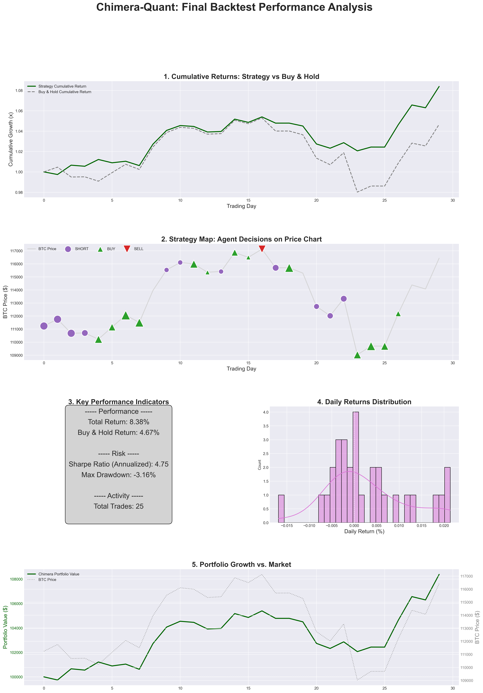
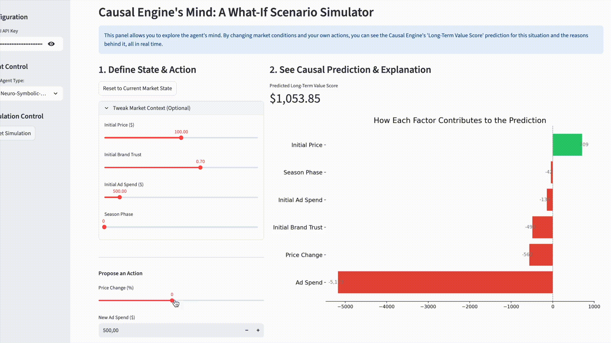
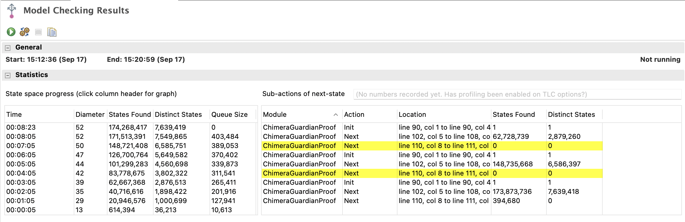

# Project Chimera: A Neuro-Symbolic-Causal AI Layer for Governance & Strategic Decision-Making
[](https://www.gnu.org/licenses/agpl-3.0)
[](https://www.python.org/downloads/)
[](http://makeapullrequest.com)

## ❤️ Our Contributors!

[](...)

---

**Project Chimera is an advanced AI agent designed to overcome the critical limitations of standard Large Language Models (LLMs) in strategic environments like trading or business management. By integrating a hybrid Neuro-Symbolic-Causal architecture, this agent makes decisions that are not only intelligent but also safe, explainable, and designed for robustness.**

---

> [!IMPORTANT]
> **🚀 MAJOR UPDATE: CHIMERA HAS EVOLVED**
>
> The core logic of Chimera has been extracted into a standalone, high-performance compiler/SDK.
>
> 🛡️ **Solidity for AI Policies:** Deterministic safety layer for probabilistic systems.
>
> 👉 **Check out and Star the new engine here:** [Chimera-Protocol/csl-core](https://github.com/Chimera-Protocol/csl-core)

---
Research Update (Nov 2025): Project Chimera’s theoretical foundations are now live on arXiv — [arXiv:2510.23682](https://arxiv.org/abs/2510.23682)

---

### 🚀 Live Demo & Usage

#### Try the Interactive Lab (Business Context)

<a href="https://project-chimera.streamlit.app/" target="_blank"></a>

---

## ❗ The Problem: Why Raw LLMs Can Be Risky

Modern LLMs are powerful, but when entrusted with critical decisions, they can be dangerously naive and unpredictable. Without proper guardrails, they can make catastrophic mistakes. Our benchmark experiment proved this: a pure `LLM-Only` agent, lacking rules or causal understanding, drove a simulated company into a multi-billion dollar loss.

---

## 💡 The Solution: The Chimera Agent in Action

Project Chimera solves this by providing the LLM with a **Symbolic** safety net and a **Causal** oracle. It doesn't just guess; it brainstorms multiple strategies, checks them against rules, and predicts their likely outcomes to find the optimal path.

You can try a **live demo** of the Strategy Lab here (Note: Demo might reflect business simulation context):

<a href="https://project-chimera.streamlit.app/" target="_blank"></a>

**See Chimera in Action** (Business Simulation Demo)


---

## 🧩 The Chimera Architecture



* **🧠 Neuro (The Brain):** The creative core (e.g., GPT-4o) that understands goals and brainstorms diverse strategies.
* **🛡️ Symbolic (The Guardian):** A rule engine that acts as a safety net, preventing catastrophic, rule-breaking decisions.
* **🔮 Causal (The Oracle):** A data-driven causal inference engine (e.g., `EconML`, custom models) that predicts the real-world impact (like profit) of potential decisions.

---

### ✨ Key Features

* **Live 24/7 Trading Stream:** Real-time dashboard showcasing agent performance and decisions.
* **Multi-Hypothesis Reasoning:** Actively brainstorms and evaluates multiple strategies before making a data-driven recommendation.
* **Dynamic Learning (Optional):** Causal Engine can be retrained periodically on performance data for adaptation.
* **Advanced XAI Suite:** Includes per-decision explainability and an interactive 'What-If' simulator.
* **Sophisticated Simulation Environment:** Used for backtesting and benchmarking.
* **Interactive Strategy Lab:** A Streamlit application (`app.py`) for real-time interaction and analysis.
* **Automated Benchmarking Suite:** Rigorous comparison scripts (`benchmark.py`).

---

### 🗺️ Roadmap: Q1 2026 & Beyond

Project Chimera is evolving from a research prototype into a decentralized, autonomous decision engine.
Our immediate focus for **Q1 2026** is twofold: **On-Chain Integration** and **Autonomous Causal Discovery**.

---

#### 🎯 Q1 2026 Strategic Priorities

| Priority | Objective | Theme |
| :--- | :--- | :--- |
| **1. Web3 Integration** | **Porting Governance to Chain** | Moving the *Symbolic Guardian* and audit logs to a decentralized infrastructure to guarantee immutable, trustless verification of AI decisions. |
| **2. Causal Discovery** | **Active Inference** | Upgrading the *Causal Engine* from passive learning to active experimentation. The agent will autonomously design and run tests to discover new causal links in its environment. |

---

#### 📍 High-Level Phases

* ✅ **Phase 1 — Strategic Depth & Provable Safety** — *COMPLETE*
    * *Theme:* Developed the Neuro-Symbolic-Causal architecture with TLA+ verified safety constraints.
* ✅ **Phase 2 — Cross-Domain Mastery (Quant & E-Com)** — *COMPLETE*
    * *Theme:* Decoupled the "Brain" from the environment, proving performance in trading and business simulations.
* ▶️ **Phase 3 — The Decentralized & Autonomous Leap** — *IN PROGRESS (Q1 2026)*
    * *Theme:* **Governance meets Web3.** Implementing the architecture on-chain for true transparency while unlocking "Autonomous Causal Discovery" so the agent learns the rules of the world without human supervision.
* 🔮 **Phase 4 — Ecosystem Leadership: The "Chimera Dev Kit"**
    * *Theme:* Packaging the technology into an open-source SDK (`pip install chimera-agent`) to enable developers to build safe, governed AI agents for any sector.
    
---

## 🔴 LIVE 24/7 Trading Stream Now Active!

**Watch the Chimera agent trade Bitcoin (Paper Trading) live on YouTube!** See its decisions, performance, and analysis updated in real-time on the dashboard.

[](https://www.youtube.com/watch?v=fa2Skk3dKnk)

**(Click the image above to watch the live stream)**

---

## 📊 Latest Performance Results

Here's a look at the agent's performance in recent backtests:

**1. Long-Term Quant Agent Performance (200 Trading Days)**

This report highlights the agent's ability to significantly outperform a Buy & Hold strategy over an extended period, demonstrating robust cumulative returns while managing drawdowns.



**2. Recent Performance Detail (30 Trading Days)**

This detailed analysis showcases the agent's decision-making on a shorter timeframe, including key performance indicators like Sharpe Ratio and a map of individual trade decisions on the price chart.



---

## 🔬 Advanced XAI: From Glass Box to Interactive Simulator
Version 1.2.1 introduced a full suite of XAI tools. The **"What-If Analysis"** tab allows you to explore the agent's reasoning by testing counterfactual scenarios live.

See the Interactive 'What-If' Simulator in Action (Business Simulation Demo):



---

## ✅ Formal Verification (TLA+)
SymbolicGuardianV4 introduced configurable safety buffers analyzed using TLA+ formal verification. This provides mathematical confidence that the safety logic consistently enforces defined constraints like minimum margins or maximum limits, even under complex scenarios.



* **Result:** Exhaustive exploration found **0 invariant violations**.
* **Interpretation:** High confidence in the safety guarantees provided by the Symbolic Guardian component. (See [V1.2.3 Release](https://github.com/akarlaraytu/Project-Chimera/releases/tag/v1.2.3 ) for details)

---

### 🚀 v1.4.0: The Colosseum


**The arena is open!** This update transforms Project Chimera into a dynamic, multi-agent competitive ecosystem. Assemble AI gladiators and watch them battle in a live simulation.

This is currently an exclusive **Closed Beta**. Access details below. Learn more in the **[v1.4.0 release notes](https://github.com/akarlaraytu/Project-Chimera/releases/tag/v1.4.0)**.

---

## 📚 Documentation & Glossary

For a quick reference of key concepts, see our [Glossary](docs/GLOSSARY.md). Check the [latest release notes](https://github.com/akarlaraytu/Project-Chimera/releases) for detailed updates.

---

### 🤝 How to Help

* **⭐ Star the repo** to follow development.
* Check **Discussions → Roadmap** for areas needing feedback.
* See **CONTRIBUTING.md** for setup and PR guidelines.
* Look for **`good first issue`** tasks if you want to contribute code.

---

#### Getting Started (Local Setup)

1.  **Clone the repository:**
    ```bash
    git clone [https://github.com/akarlaraytu/Project-Chimera.git](https://github.com/akarlaraytu/Project-Chimera.git)
    cd Project-Chimera
    ```
2.  **Create environment & install dependencies:**
    ```bash
    python3 -m venv venv
    source venv/bin/activate
    pip install -r requirements.txt
    ```
3.  **Set API Keys (e.g., OpenAI, Alpaca):**
    ```bash
    # Create a .env file in the root directory
    # Add your keys like this:
    # OPENAI_API_KEY='sk-...'
    # ALPACA_API_KEY='...'
    # ALPACA_SECRET_KEY='...'
    # YOUTUBE_STREAM_KEY='...'
    ```
4.  **Run Applications:**
    ```bash
    # Run the Interactive Demo (Streamlit App for E-commerce Simulation)
    streamlit run app.py

    # Run Automated Benchmarks (E-commerce Simulation)
    python3 benchmark.py
    python3 benchmark_learning.py

    # Run Quant Trading Backtest
    python3 quant_run_backtest.py

    # Run the Live Quant Trading Agent (Requires .env setup)
    # python3 live_paper_trader.py

    # Run the Live Quant Trading Dashboard Stream (Requires .env setup)
    # python3 chimera_live.py --stream
    ```

---

### 🤝 Contributing

Contributions, issues, and feature requests are welcome! Check the [issues page](https://github.com/akarlaraytu/Project-Chimera/issues).

### 📄 License

This project is licensed under the **GNU AGPLv3 License** - see the `LICENSE` file.

---

*Developed with passion by [Aytug Akarlar](https://www.linkedin.com/in/aytuakarlar/) *