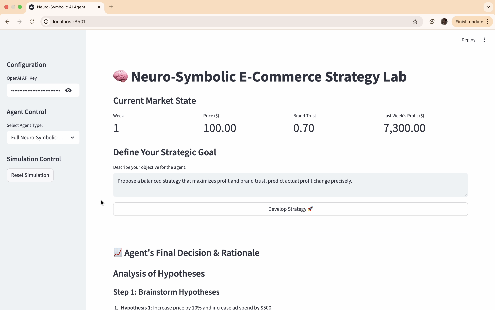

# Project Chimera: A Neuro-Symbolic-Causal AI Agent for Strategic Decision-Making

[](https://opensource.org/licenses/MIT)
[](https://www.python.org/downloads/)
[](http://makeapullrequest.com)

**Project Chimera is an advanced AI agent designed to overcome the critical limitations of standard Large Language Models (LLMs) in strategic business environments. By integrating a hybrid Neuro-Symbolic-Causal architecture, this agent makes decisions that are not only intelligent but also safe, explainable, and provably profitable.**

---

## ❗ The Problem: Why Raw LLMs are Dangerous for Business

Modern LLMs are powerful, but when entrusted with critical business decisions, they can be dangerously naive and unpredictable. Without proper guardrails, they can make catastrophic mistakes. Our benchmark experiment proves this: we tasked a pure `LLM-Only` agent with managing a simulated e-commerce business for one year. Lacking an understanding of rules or the causal consequences of its actions, it drove the company into a **multi-billion dollar loss**.

---

## 💡 The Solution: The Chimera Agent in Action

Project Chimera solves this by providing the LLM with a **Symbolic** safety net and a **Causal** oracle. It doesn't just guess; it brainstorms multiple strategies, checks them against business rules, and predicts their financial outcomes to find the optimal path.

You can try a **live demo** of the Strategy Lab here:

<a href="https://project-chimera.streamlit.app/" target="_blank"></a>

**Watch the 1-minute video below to see the agent's intelligence in action:**

<a href="https://youtu.be/e8h9FvE_l80?si=4iyv8mwzRdk6bbi1" target="_blank">
 
</a>

---

## 🧩 The Chimera Architecture


* **🧠 Neuro (The Brain):** The creative core (GPT-4o) that understands goals and brainstorms diverse strategies.  
* **🛡️ Symbolic (The Guardian):** A rule engine that acts as a safety net, preventing catastrophic, rule-breaking decisions.  
* **🔮 Causal (The Oracle):** A data-driven causal inference engine (`EconML`) that predicts the profit impact of potential decisions.

---

### ✨ Key Features

* **Multi-Hypothesis Reasoning:** The agent actively brainstorms and evaluates multiple strategies before making a data-driven recommendation.
* **Dynamic Learning from Experience:** The agent's Causal Engine retrains periodically on its own performance data, allowing it to adapt and improve.
* **Advanced Economic Simulator:** A sophisticated simulation environment featuring non-linear dynamics like price elasticity and diminishing returns.
* **Interactive Strategy Lab:** A full-featured Streamlit application (`app.py`) for real-time interaction and analysis.
* **Automated Benchmarking Suite:** A powerful research script (`benchmark.py`) to rigorously compare different agent architectures.

---

## 📈 Evolution & Development Report

### Starting Point: High Potential but Raw (V7.2)
Initially, our Full Neuro-Symbolic-Causal agent behaved like a lucky but shortsighted LLM+Symbolic agent due to a broken learning mechanism — chasing short-term gains and eroding brand trust.

### Step-by-Step Improvements

#### 1. Intelligence & Strategy
- **Trust-Adjusted Profit Metric:** Added `TRUST_VALUE_MULTIPLIER` to balance profit with long-term brand trust.  
- **Dynamic Strategic Personality:** “Strategy Interpreter” adjusts multiplier based on mission type (profit, balanced, trust).  
- **Mandatory Rule Validation:** All hypotheses checked via `check_business_rules` before execution.  
- **Improved Forecast Accuracy:** Added `initial_ad_spend` context to CausalEngine.

#### 2. Architecture & Efficiency
- **Benchmark Speed-Up:** CausalEngine initializes once per simulation.  
- **Richer Simulation Physics:** Tuned `price_elasticity` and added `seasonality_amp`.  
- **Decision Caching:** Interactive app remembers past similar decisions.

#### 3. Benchmarking & Analysis
- **Multi-Scenario Testing:** Runs “Brand-Focused”, “Profit-Maximization”, and “Balanced” with separate reports.  
- **Expanded Metrics:** Added cumulative/average weekly profit and ad spend tracking.  
- **Live Strategy Feed:** Real-time logging of weekly decisions.

---

## 📊 Benchmark Results Across Strategic Scenarios

### 1. Brand Trust Focus


| Agent Type                  | Total Profit (Cumulative) | Avg. Weekly Profit | Final Brand Trust | Final Price | Final Ad Spend |
|-----------------------------|---------------------------|--------------------|-------------------|-------------|----------------|
| **Full Neuro-Symbolic-Causal** | $2,032,412.65             | $38,347.41         | **1.000**         | $75.97      | $3000.00       |
| LLM-Only                    | $1,418,021.20             | $26,755.12         | 0.633             | $99.00      | $0.10          |
| LLM + Symbolic              | $812,497.59               | $15,330.14         | 0.843             | $59.31      | $500.00        |

---

### 2. Profit Maximization


| Agent Type                  | Total Profit (Cumulative) | Avg. Weekly Profit | Final Brand Trust | Final Price | Final Ad Spend |
|-----------------------------|---------------------------|--------------------|-------------------|-------------|----------------|
| **Full Neuro-Symbolic-Causal** | $2,226,910.00             | $42,017.17         | 0.871             | $130.00     | $1500.00       |
| LLM + Symbolic              | $1,795,430.20             | $33,876.04         | 0.772             | $106.03     | $800.00        |
| LLM-Only                    | $1,571,889.33             | $29,658.29         | 0.648             | $125.56     | $0.05          |

---

### 3. Balanced Strategy


| Agent Type                  | Total Profit (Cumulative) | Avg. Weekly Profit | Final Brand Trust | Final Price | Final Ad Spend |
|-----------------------------|---------------------------|--------------------|-------------------|-------------|----------------|
| **Full Neuro-Symbolic-Causal** | ~$1,612,000               | ~$31,362.00        | ~0.773            | ~$100.15    | ~$3000.00      |
| LLM + Symbolic              | ~$1,320,000               | ~$25,443.10        | ~0.643            | $100.00     | ~$25.00        |
| LLM-Only                    | ~$1,274,000               | ~$24,592.27        | ~0.638            | $100.00     | ~$0.10         |

---

### 🗺️ Future Roadmap

Project Chimera is a living project. The next steps in our vision include:

* **Deep XAI (Explainable AI):** Integrating a Causal Graph visualization layer to explain *why* the Causal Engine predicted a certain outcome.
* **Multi-Agent Competitive Simulations:** Evolving the benchmark into an ecosystem where multiple Chimera agents compete against each other in the same market.
* **Domain-Agnostic Framework:** Refactoring the core logic into a general-purpose framework for other domains like finance or healthcare.

---

### 🚀 Live Demo & Usage

#### Try the Interactive Lab

You can try a live version of the Strategy Lab here:

<a href="https://project-chimera.streamlit.app/" target="_blank"></a>

---

#### Getting Started

1.  **Clone the repository:**
    ```bash
    git clone [https://github.com/akarlaraytu/Project-Chimera.git](https://github.com/akarlaraytu/Project-Chimera.git)
    cd Project-Chimera
    ```
2.  **Create a virtual environment and install dependencies:**
    ```bash
    python3 -m venv venv
    source venv/bin/activate
    pip install -r requirements.txt
    ```
3.  **Set your OpenAI API Key:**
    ```bash
    export OPENAI_API_KEY='sk-...'
    ```
4.  **Run the Interactive Demo:**
    ```bash
    streamlit run app.py
    ```
5.  **Run the Automated Benchmarks:**
    ```bash
    python3 benchmark.py
    python3 benchmark_learning.py
    ```
     
---

### 🤝 Contributing

Contributions, issues, and feature requests are welcome! Feel free to check the [issues page](https://github.com/akarlaraytu/Project-Chimera/issues).

### 📄 License

This project is licensed under the MIT License - see the [LICENSE.md](LICENSE.md) file for details.

---

*Developed with passion by [Aytug Akarlar](https://www.linkedin.com/in/aytuakarlar/) in collaboration with a strategic AI partner.*
