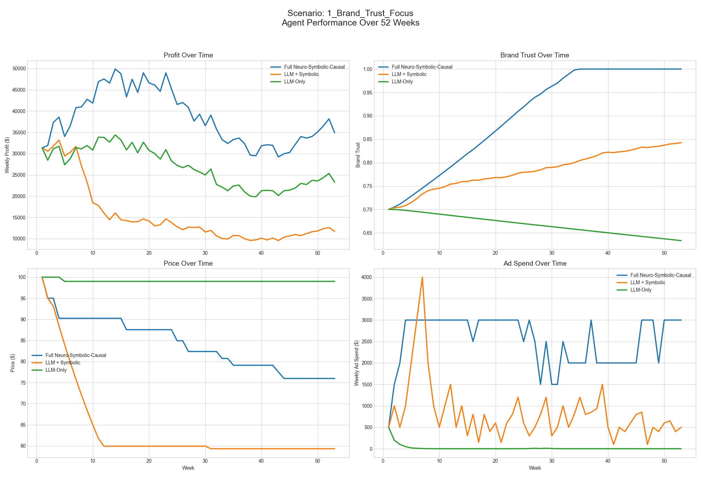
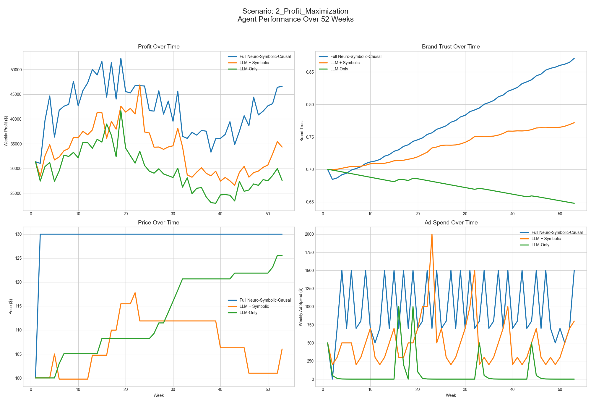
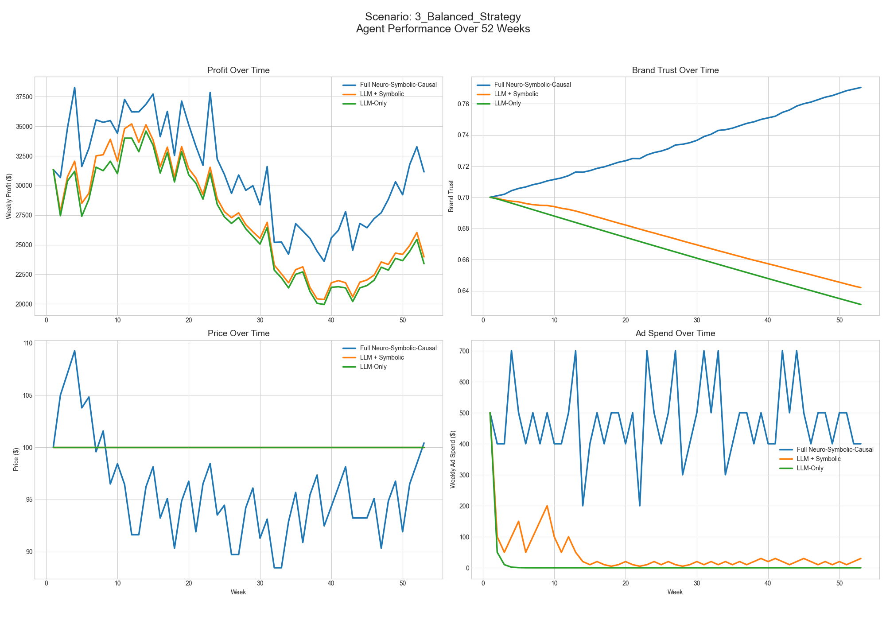

# Project Chimera: A Neuro-Symbolic-Causal AI Agent for Strategic Decision-Making
<!-- ALL-CONTRIBUTORS-BADGE:START - Do not remove or modify this section -->
[](#contributors-)
<!-- ALL-CONTRIBUTORS-BADGE:END -->

[](https://opensource.org/licenses/MIT)
[](https://www.python.org/downloads/)
[](http://makeapullrequest.com)


## ❤️ Our Contributors!

Thanks goes to these wonderful people

<!-- ALL-CONTRIBUTORS-LIST:START - Do not remove or modify this section -->
<!-- prettier-ignore-start -->
<!-- markdownlint-disable -->
<table>
  <tbody>
    <tr>
      <td align="center" valign="top" width="14.28%">
        <a href="https://www.linkedin.com/in/aytuakarlar/">
          
          <br />
          <sub><b>Aytug Akarlar</b></sub>
        </a>
      </td>
      <td align="center" valign="top" width="14.28%">
        <a href="https://github.com/panagiotisbellias">
          
          <br />
          <sub><b>Panagiotis Bellias</b></sub>
        </a>
      </td>
      <td align="center" valign="top" width="14.28%">
        <a href="https://rapteon.github.io">
          
          <br />
          <sub><b>Rapteon</b></sub>
        </a>
      </td>
    </tr>
  </tbody>
</table>

<!-- markdownlint-restore -->
<!-- prettier-ignore-end -->

<!-- ALL-CONTRIBUTORS-LIST:END -->

We are a growing community!

---

**Project Chimera is an advanced AI agent designed to overcome the critical limitations of standard Large Language Models (LLMs) in strategic business environments. By integrating a hybrid Neuro-Symbolic-Causal architecture, this agent makes decisions that are not only intelligent but also safe, explainable, and provably profitable.**

---

### 🚀 v1.4.0: The Colosseum is LIVE!


**The arena is open!** Our most ambitious update transforms Project Chimera into a dynamic, multi-agent competitive ecosystem. You can now assemble a team of AI gladiators and watch them battle for supremacy in a live simulation.

This is an exclusive **Closed Beta** for our early supporters. To learn more and find out how to join, check out the **[latest release notes](https://github.com/akarlaraytu/Project-Chimera/releases/tag/v1.4.0)**!

---

### 🎟️ How to Join the Closed Beta

This exclusive closed beta is a thank you to our earliest supporters. Access will be granted on **October 7th** to:

* **⭐ GitHub Stargazers:** If you've starred our repository, you're on the list!
* **📖 Medium Followers:** If you subscribe our publications, you're on the list!

If you haven't yet, it's not too late to secure your spot:
1.  **Star the Repo:** [Click here to go to the GitHub Repository](https://github.com/akarlaraytu/Project-Chimera-FINAL)
2.  **Follow on Medium:** [Click here to go to our Medium Page](https://medium.com/@your_handle)

Invitations and access details will be shared with the community on launch day!

---

## ❗ The Problem: Why Raw LLMs are Dangerous for Business

Modern LLMs are powerful, but when entrusted with critical business decisions, they can be dangerously naive and unpredictable. Without proper guardrails, they can make catastrophic mistakes. Our benchmark experiment proves this: we tasked a pure `LLM-Only` agent with managing a simulated e-commerce business for one year. Lacking an understanding of rules or the causal consequences of its actions, it drove the company into a **multi-billion dollar loss**.

---

## 💡 The Solution: The Chimera Agent in Action

Project Chimera solves this by providing the LLM with a **Symbolic** safety net and a **Causal** oracle. It doesn't just guess; it brainstorms multiple strategies, checks them against business rules, and predicts their financial outcomes to find the optimal path.

You can try a **live demo** of the Strategy Lab here:

<a href="https://project-chimera.streamlit.app/" target="_blank"></a>

**See Chimera in Action**


---

## 🧩 The Chimera Architecture


* **🧠 Neuro (The Brain):** The creative core (GPT-4o) that understands goals and brainstorms diverse strategies.  
* **🛡️ Symbolic (The Guardian):** A rule engine that acts as a safety net, preventing catastrophic, rule-breaking decisions.  
* **🔮 Causal (The Oracle):** A data-driven causal inference engine (`EconML`) that predicts the profit impact of potential decisions.

---

### ✨ Key Features

* **Multi-Hypothesis Reasoning:** The agent actively brainstorms and evaluates multiple strategies before making a data-driven recommendation.
* **Dynamic Learning from Experience:** The agent's Causal Engine (CausalEngineV6) retrains periodically on its own performance data, allowing it to adapt and improve.
* **Advanced XAI Suite:** Go beyond "black box" predictions with:
    * **Per-Decision Explainability:** A SHAP-based panel that shows the factors driving each specific decision.
    * **Interactive 'What-If' Simulator:** A tool to explore the agent's mind by changing market conditions and seeing how its predictions change in real-time.
* **Advanced Economic Simulator:** A sophisticated simulation environment featuring non-linear dynamics like price elasticity and diminishing returns.
* **Interactive Strategy Lab:** A full-featured Streamlit application (`app.py`) for real-time interaction and analysis.
* **Automated Benchmarking Suite:** A powerful research script (`benchmark.py`) to rigorously compare different agent architectures.

---

## 🔬Advanced XAI: From Glass Box to Interactive Simulator
Version 1.2.1 introduces a full suite of XAI tools. We didn't just want to see why the agent made a decision; we wanted to interact with its reasoning. The new **"What-If Analysis"** tab allows you to do exactly that—explore the agent's mind by testing counterfactual scenarios live.

See the Interactive 'What-If' Simulator in Action:


---

# Chimera v1.2.3 - Formal Verification (TLA+)

## Purpose
SymbolicGuardianV4 introduces a configurable safety buffer above the minimum safe price threshold to eliminate rounding/precision edge‑case violations observed in formal analysis.  
This verification ensures that the repair logic **always** enforces:
- Buffered minimum profit margin
- Maximum price cap
- Absolute and relative advertising spend caps

The model is written in TLA+ and checked with the TLC model checker to provide mathematical confidence in these safety guarantees.


## Results Summary (Run: 2025‑09‑17)


- **Distinct states explored:** 7,639,419  
- **Diameter reached:** 5  
- **Invariant violations:** 0  
- **Observed fingerprint collision probability:** ~1.85 × 10⁻⁹  
- **Calculated upper bound:** 6.95 × 10⁻⁵

**Interpretation:**  
Under the modeled nondeterminism over price and advertising proposals, TLC exhaustively explored millions of states without finding any violation of the defined safety properties. The observed collision probability is far below the calculated bound, supporting the reliability of the result.

For more information check [V1.2.3 Release](https://github.com/akarlaraytu/Project-Chimera/releases/tag/v1.2.3 )

---

## 📊 Benchmark Results Across Strategic Scenarios

### 1. Brand Trust Focus



| Agent Type                  | Total Profit (Cumulative) | Avg. Weekly Profit | Final Brand Trust | Final Price | Final Ad Spend |
|-----------------------------|---------------------------|--------------------|-------------------|-------------|----------------|
| **Full Neuro-Symbolic-Causal** | $2,032,412.65             | $38,347.41         | **1.000**         | $75.97      | $3000.00       |
| LLM-Only                    | $1,418,021.20             | $26,755.12         | 0.633             | $99.00      | $0.10          |
| LLM + Symbolic              | $812,497.59               | $15,330.14         | 0.843             | $59.31      | $500.00        |

---

### 2. Profit Maximization



| Agent Type                  | Total Profit (Cumulative) | Avg. Weekly Profit | Final Brand Trust | Final Price | Final Ad Spend |
|-----------------------------|---------------------------|--------------------|-------------------|-------------|----------------|
| **Full Neuro-Symbolic-Causal** | $2,226,910.00             | $42,017.17         | 0.871             | $130.00     | $1500.00       |
| LLM + Symbolic              | $1,795,430.20             | $33,876.04         | 0.772             | $106.03     | $800.00        |
| LLM-Only                    | $1,571,889.33             | $29,658.29         | 0.648             | $125.56     | $0.05          |

---

### 3. Balanced Strategy



| Agent Type                  | Total Profit (Cumulative) | Avg. Weekly Profit | Final Brand Trust | Final Price | Final Ad Spend |
|-----------------------------|---------------------------|--------------------|-------------------|-------------|----------------|
| **Full Neuro-Symbolic-Causal** | ~$1,612,000               | ~$31,362.00        | ~0.773            | ~$100.15    | ~$3000.00      |
| LLM + Symbolic              | ~$1,320,000               | ~$25,443.10        | ~0.643            | $100.00     | ~$25.00        |
| LLM-Only                    | ~$1,274,000               | ~$24,592.27        | ~0.638            | $100.00     | ~$0.10         |

---

### 🗺️ Future Roadmap

Project Chimera is a living project. The next steps in our vision include:
* **Multi-Agent Competitive Simulations:** Evolving the benchmark into an ecosystem where multiple Chimera agents compete against each other in the same market.
* **Domain-Agnostic Framework:** Refactoring the core logic into a general-purpose framework for other domains like finance or healthcare.
* **Autonomous Learning & Self-Improvement:** Enabling the agent to not just learn from data, but to actively run its own experiments to discover new causal relationships in the environment.
---

### 🚀 Live Demo & Usage

#### Try the Interactive Lab

You can try a live version of the Strategy Lab here:

<a href="https://project-chimera.streamlit.app/" target="_blank"></a>

---

#### Getting Started

1.  **Clone the repository:**
    ```bash
    git clone [https://github.com/akarlaraytu/Project-Chimera.git](https://github.com/akarlaraytu/Project-Chimera.git)
    cd Project-Chimera
    ```
2.  **Create a virtual environment and install dependencies:**
    ```bash
    python3 -m venv venv
    source venv/bin/activate
    pip install -r requirements.txt
    ```
3.  **Set your OpenAI API Key:**
    ```bash
    export OPENAI_API_KEY='sk-...'
    ```
4.  **Run the Interactive Demo:**
    ```bash
    streamlit run app.py
    ```
5.  **Run the Automated Benchmarks:**
    ```bash
    python3 benchmark.py
    python3 benchmark_learning.py
    ```
     
---

### 🤝 Contributing

Contributions, issues, and feature requests are welcome! Feel free to check the [issues page](https://github.com/akarlaraytu/Project-Chimera/issues).

### 📄 License

This project is licensed under the MIT License - see the [LICENSE.md](LICENSE.md) file for details.

---

*Developed with passion by [Aytug Akarlar](https://www.linkedin.com/in/aytuakarlar/) in collaboration with a strategic AI partner.*

## Contributors ✨

Thanks goes to these wonderful people ([emoji key](https://allcontributors.org/docs/en/emoji-key)):

<!-- ALL-CONTRIBUTORS-LIST:START - Do not remove or modify this section -->
<!-- prettier-ignore-start -->
<!-- markdownlint-disable -->
<!-- markdownlint-restore -->
<!-- prettier-ignore-end -->
<!-- ALL-CONTRIBUTORS-LIST:END -->

This project follows the [all-contributors](https://github.com/all-contributors/all-contributors) specification. Contributions of any kind welcome!